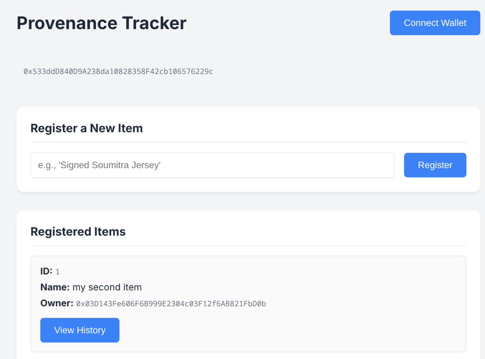

# Verifiable On-Chain Provenance Tracker


This project is a fully functional decentralized application (DApp) built on the Ethereum blockchain that serves as a verifiable, on-chain provenance tracker. It allows users to register unique digital items, transfer ownership, and view the complete, immutable history of any item, demonstrating a core concept behind Non-Fungible Tokens (NFTs).

This DApp was built as the final assignment for the "Blockchain Arena" mentorship program.



---

## Features

-   **Connect to Wallet:** Securely connect to the Ethereum network using MetaMask.
-   **Register Items:** Create a new, unique on-chain record for any item, with the creator assigned as the initial owner.
-   **Transfer Ownership:** A simple and secure interface for the current owner to transfer an item to another address. The UI for transferring only appears for items you own.
-   **View Provenance:** Click on any item to view its complete, tamper-proof ownership history in a clean, user-friendly modal pop-up.

---

## Technology Stack

-   **Blockchain:** Ethereum (Sepolia Testnet)
-   **Smart Contract:** Solidity
-   **Frontend:** HTML5, CSS3, JavaScript (ES6+)
-   **Web3 Library:** ethers.js v5
-   **Development Tools:** Remix IDE, VS Code, Live Server

---

## Getting Started

To run this project locally, follow these steps.

### Prerequisites

1.  A modern web browser (like Chrome or Firefox).
2.  The [MetaMask](https://metamask.io/download/) browser extension installed.
3.  An account in MetaMask funded with some Sepolia test ETH. You can get some from a faucet like [sepolia-faucet.pk910.de](https://sepolia-faucet.pk910.de/).

### Running Locally

1.  **Clone the repository:**
    ```bash
    git clone https://github.com/soumitra1854/verifiable-nft-tracker.git
    ```

2.  **Navigate to the project directory:**
    ```bash
    cd verifiable-nft-tracker
    ```

3.  **Open the `index.html` file:**
    The easiest way is to use a simple web server. If you are using VS Code, you can use the **"Live Server"** extension. Right-click on `index.html` and select "Open with Live Server".

4.  **Use the DApp:**
    -   Click "Connect Wallet" to connect your MetaMask account.
    -   Register new items, transfer them, and view their history.

---

## Smart Contract on Sepolia

The `Tracker.sol` smart contract has been deployed to the Sepolia testnet and can be viewed on Etherscan.

-   **Contract Address:** `0x0c5fc78A13637038507f4dF14801d7fA8a059F39`
-   **Etherscan Link:** `https://sepolia.etherscan.io/address/0x0c5fc78A13637038507f4dF14801d7fA8a059F39`